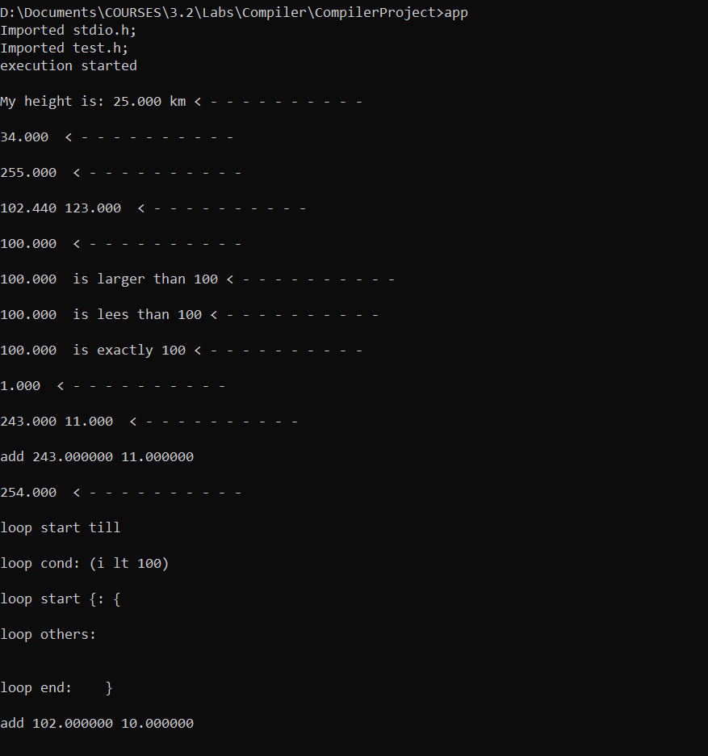
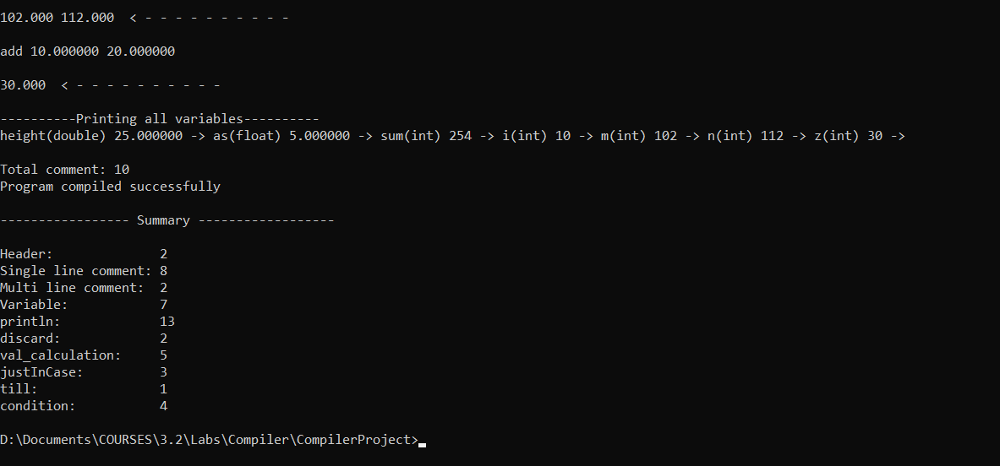

# CompilerProject Structure

## Header
- Using import,
- Ex:
    ```
    import stdio;
    import math;
    ```

## Comment
- ### Single line comment
    - Using `//`,
    - Ex:
        ```
        int a = 25;
        // this is single line comment

        int b = 123; // also valid here
        ```
- ### Multi-line comment
    - Using `/*  */`,
    - Support nested also,
    - Ex:
        ```
            int y = x sub 999; 
            /*multi line comment
                possible to have
                /* nested also */
            */

            discard c,d,e, /* valid comment */ f;
        ```

## Prototype declaration
- Format:
    ```
    FUNC_TYPE FUNC_NAME (DATA_TYPE1, DATA_TYPE_2...);
    ```
- Example:
    ```
    int add(int,int, float);
    int scan();
    void add(int, float, double);
    ```

## Starting point of execution
- Defined as:
- Ex:
    ```
    static void entryPoint(){
        // starts from here
    }
    ```


## Variable
- ### Supporeted Data type
    - `int`, `float`, `double`
- ### Declaration:
    - Using:
        ```
        DATA_TYPE VAR1, VAR2;
        ```
    - Ex:
        ```
        int a;
        int b;
        
        int c,d,e;
        ```
- ### Initialization
    - Using:
        ```
        DATA_TYPE VAR1 = const_value, VAR2 = calc_value, VAR3 = func_call;
        ```
    - Ex:
        ```
        int m = 102, n = m add 10;
        // m = 102, n = 112
        ```
- ### Assignment
    - Using
        ```
        VAR = const_value or calc_value or func_call;
        ```
    - Ex:
        ```
            int z;
            z = 100; // constant
            z = 10 add 20; // calculated value
            b = @max(a,101); // function call
        ```
- ### Loop
    - Using
        ```
        till( VAR_CON <COND_OP> VAR_CON ){
            VAR_CON = VAR_CON <ARITH_OP> VAR_CON;
        }
        ```
    - Example:
        ```
        int j = 55;
        till(j <gt> 0){
            j = j <sub> 15;
        }
        ```
    - Output:
        ```
        Iterating - 0, value: 55
        Iterating - 1, value: 40
        Iterating - 2, value: 25
        Iterating - 3, value: 10
        ```

- ### Extra:
    - Initialized to `0` by default,
    - Error if `duplicate variable` is declared,
    - Error if assign value to `undeclared variable`,
    - All variables are become global once declared,
    - Variable remains gloabl until `discarded` explicitly,
- ### Ex:
    ```
    static void main(){
        // [] <---------------------------------

        int c = 1055;
        int d = 3443;

        // [c,d] <------------------------------
        c = 1220;

        if( 100 lt d){
            c = 433;
            int dd = 343;
            // [c,d,dd] <-----------------------
        }

        c = 4333;

        // [c,d,dd] <--------------- see dd here

        discard d;

        // [c,dd] <-----------------------------
    }
    ```

- ## Arithmatic operators
    - Addition`(add)`,
    - Subtraction `(sub)`,
    - Multiplication `(mul)`,
    - Division `(div)`,
    - Difference `(dif)`,
    - Remainder `(rem)`
    - Ex:
        ```
        float f1 = 243, f2=11;
        int sum = f1 add f2;

        double b = 102.44;
        b = b sub 2.44;
        ```

- ## Conditional operators
    - less than `(lt)`,
    - greater than `(gt)`,
    - equal `(eq)`,
    - not equals `(neq)`
    - less equal `(le)`,
    - greater equal `(ge)`
    - Ex:
        ```
        if( 100 lt d){
            c = 433;
            int dd = 343;
        }
        ```

- ## `justInCase` structure:
    - Equivalent to `if`,
    - Structure:
        ```
        justInCase(vc @ vc){
            // body
        }
        ```
        `vc` = variable or constant, `@` = conditional operator
    - Ex:
        ```
        if( 100 lt d){
            c = 433;
            int dd = 343;
        }
        ```
    - vc = variable or constant
    - no else statment
- ## Looping
    - Structure:
        ```
        till(vc @ vc){
            //body
        }
        ```
    - Ex:
        ```
        int i=10;
        till(i lt 100){
            //body
        }
        ```

- ## Output to console
    - Using `println()`,
    - Structure:
        ```
        println(vc1, vc2, ... vcn);
        ```
    - Comma(``,`) and space(`' '`) both are valid as separator,
    - Ex:
        ```
        float f1 = 243, f2=11;

        println(f1,f2);

        double height = 25;
        println("My height is: ",height "km");
        ```
    - Output is like
        ```
        243.000 11.000  < - - - - - - - - - -

        My height is: 25.000 km < - - - - - - - - - -
        ```
- ## Overall example:
```
import stdio.h;
import test.h;

//starting point of program
static void entryPoint(){


   double height = 25;
   println("My height is: ",height "km");
   
   //variable declaration
   int a = 34;
   float as=5;

   println(a);

   a = 255;

   println(a);

   discard a;
   
   double b = 102.44, c= 123;

   println(b, c);

   b = b sub 2.44;
   println(b);

   justInCase( b gt 99){
      println(b," is larger than 100");
   }

   justInCase( b lt 500){
      println(b " is lees than 100");
   }

   justInCase(b eq 100){
      println(b, " is exactly 100");
   }

   //single line comment

   int x = 1000; // initializing

   int y = x sub 999; 
   /*
   multi line comment
   possible to have
   /*
   nested also
   */
   */

   println(y);

   float f1 = 243, /* also valid here */ f2=11;

   println(f1,f2);

   int sum = f1 add f2;

   discard b,x,y,c,f1,f2;
   println(sum);

   int i=10;
   till(i lt 100){
      
   }


   int m = 102, n = m add 10;
   println(m,n);

   int z;
   z = 100;
   z = 10 add 20;
   println(z);

   // header(0), single(1), multi(2), var(3), 
   // print(4), dis(5), calc_val(6), if(7), 
   // till(8), cond(9)
   // int tempCounter[10];

}

```

## Output


## Run using
```
bison -d final.y
flex final.l
gcc final.tab.c prototype_list.c  lex.yy.c constant.c var_list.c -o app
app
```
